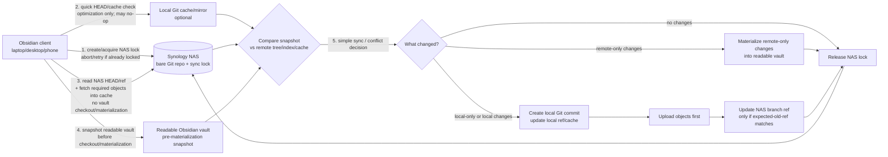
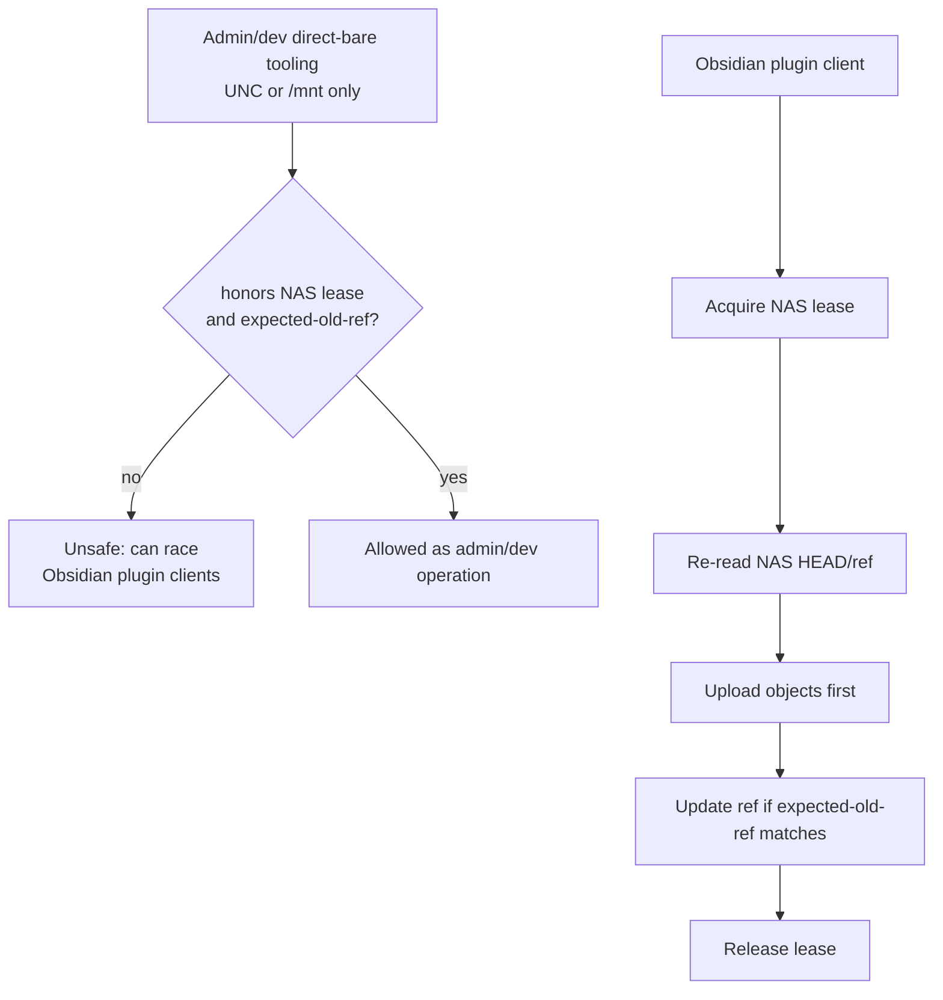

# Architecture

This plugin supports File Station connections via QuickConnect or a direct Synology address, with two intentionally different sync architectures layered on top: Simple File Sync (Single User) or Git-bare-backed Sync. Settings, validation, logs, and support guidance should preserve this distinction instead of treating all modes as variants of one remote folder sync.

`README.md` is the user-facing explanation of this architecture. It should explain the sync-mode choice in simple terms, so a non-developer can decide which option to check and understand how that choice affects where their readable notes live. Build, test, and contribution instructions belong in `CONTRIBUTING.md`, not the README.

## Sync modes

### Simple File Sync (Single User)

Simple file sync uses Synology File Station as a file API for a human-readable NAS folder.

Required configuration:

- File Station or QuickConnect connection settings
- Remote folder path, for example `/homes/user/Obsidian/MyVault`

Behavior:

- The NAS folder contains normal Markdown/assets that can be browsed directly.
- Conflict handling is the plugin's file-level conflict strategy.
- This is the default and mobile-friendly mode.
- This mode is intended for single-user or simple workflows.

### Git-bare-backed Sync

Git-bare-backed Sync uses File Station/QuickConnect as the transport for a bare Git repository stored on the NAS.

Required configuration:

- File Station or QuickConnect connection settings
- NAS bare Git repository path, for example `/homes/user/Obsidian/MyVault.git`

Not required:

- Remote folder path

Behavior:

- The NAS path is a bare Git repository, not a readable notes folder.
- Human-readable notes live in each local checkout/vault.
- The bare repository is the shared upstream for multi-device Obsidian clients, such as two laptops, a phone, and a desktop that may all be online around the same time.
- The supported product path is Obsidian clients publishing through this plugin over File Station/QuickConnect.
- Native Git is an implementation detail against the local worktree/cache/bare mirror. It is not a supported remote transport surface.
- UNC and `/mnt` direct-bare access is admin/developer tooling outside the mobile plugin contract. If such tooling writes to the bare repo, it must honor the same lease and expected-old-ref discipline or it can race plugin clients.
- Git SSH/HTTPS remotes are intentionally not supported by this plugin. Users who want normal Git remotes should use a pure Git/Obsidian Git plugin instead.
- The picker/validation must only accept a bare Git repo shape: `HEAD`, `objects/`, and `refs/`.
- On desktop runtimes with local filesystem access, this mode may use native Git against the local checkout/cache while still treating File Station/QuickConnect as the supported NAS transport.
- On iOS/mobile runtimes without `getBasePath()`, this mode uses a pure-JS Git engine over Obsidian's vault APIs instead of desktop-only Node/native Git APIs.

Bootstrap requirements:

- The plugin must support both new/empty Obsidian vaults and existing Obsidian vaults with user notes already present.
- The plugin must support both empty/new NAS bare Git repositories and existing NAS bare Git repositories with history already present.
- Empty local vault + empty remote repo: create the initial Git history from the local vault once there is content to sync.
- Existing local vault + empty remote repo: checkpoint/commit the local vault and publish it as the initial remote history.
- Empty local vault + existing remote repo: materialize/check out the remote history into the local vault without requiring a separate desktop clone step.
- Existing local vault + existing remote repo: checkpoint local state first, then merge/reconcile remote history; never silently overwrite local notes during setup.
- A brand-new Obsidian vault may contain `.obsidian/` metadata and should still be treated as effectively empty when there are no user notes/assets.

Sync operation model:

- File Station is not Git protocol. The safe mental model is: bring enough of the NAS bare repository state onto the device, perform Git operations locally against the device vault/cache, then publish the resulting repository objects/ref update back to Synology through File Station.
- Every Git-bare-backed Sync that may write remote state must use the lock/lease protocol. The lease is not optional background protection; it is part of the write path.
- Any pre-lock listing must be limited to non-authoritative UI/preflight readiness only. Sync-authoritative NAS ref reads and object fetches happen after the lock/lease is acquired; cache reuse must fail closed if post-lock verification cannot prove the required objects match the locked NAS ref.
- Local Git operations may use a persistent cache when available, but cache reuse must not skip remote ref verification under the lease.
- Sync should be smart/incremental. Clients should avoid blindly downloading or uploading the entire repository on every run when safe change detection is available.
- The minimal read set for a File Station transport is the Git files needed to identify and inspect the branch tip: read `HEAD`, then resolve the target branch from `refs/heads/<name>` or from `packed-refs` if the loose ref is absent. After resolving the tip commit, read its object at `objects/<sha[0:2]>/<sha[2:]>` and the tree/subtree/blob objects reachable from that commit that are needed to compare against the local vault snapshot. The client should fetch specific reachable objects, not clone all historical objects by default.
- The minimal publish set is the new loose Git objects created by the sync: changed blob objects, updated tree objects, the new commit object, and finally the target branch ref such as `refs/heads/main`. Objects must be uploaded before the ref is updated, and the ref update must still use the lease/expected-old-ref safety rules.
- If required objects are packed under `objects/pack/`, the client must either read the relevant pack index/data safely or fall back to a broader transfer. Pack handling is an implementation detail, but it must fail closed rather than guessing that missing loose objects are absent from history. Mobile/pure-JS implementations must treat large or unsupported packfiles as an explicit blocked/needs-desktop-bootstrap state instead of exhausting memory or silently degrading correctness.
- Change detection may use File Station metadata such as size and modification time, Git object IDs, file hashes, cached manifests, or another reliable fingerprint strategy. Metadata shortcuts must be conservative: if the client cannot prove an object/file is unchanged, it should verify or transfer rather than risk missing data.
- Publishing order must be objects first, ref last. The final ref update must include an expected-old-ref check while the lease is held, and clients must re-read the NAS branch ref before publishing so stale mirrors fail closed. Ref publication should use File Station's safest available replacement primitive, such as upload-to-temp followed by server-side rename/move where supported, so readers never observe a partially written ref file. If the ref update times out or returns an ambiguous result, the client must keep the sync in an uncertain state until it re-reads the NAS ref and verifies whether the update landed.
- Releasing the lease is the final step after the ref update succeeds or after a safe abort/rollback path.
- Preserved conflict-copy names must be stable for the same local content so repeat syncs do not create unbounded duplicate copies. New local content should still get a distinct preserved copy.

#### Git-bare-backed Sync flow

The Git-bare-backed Sync flow has four distinct jobs: acquire the NAS sync lease, read/fetch remote Git refs and required objects from Synology into the Git cache, reconcile the local vault snapshot against that state, and publish any resulting Git commit back to the NAS bare repository before releasing the lease. Reading remote Git state must not materialize or check out remote files into the readable vault before the local vault snapshot. A successful mobile/local-write sync must include all four when local notes changed.

Operational sequence:

- **Step 1: Create/acquire the NAS sync lock first.** Before doing sync work, create/place the File Station lock/lease on the NAS. If another client already holds it, abort/retry rather than racing. The lock remains held until publish succeeds or the run safely aborts.
- **Step 2: Local cache/mirror HEAD preflight.** If a local Git cache/mirror exists, read its HEAD/ref and object availability as an optimization/readiness check. This can identify an obvious no-op or missing-object condition, but it is not final authority for writes.
- **Step 3: Read NAS HEAD/ref through File Station.** The product authority is the NAS bare repo as observed through File Station/QuickConnect, not SSH/HTTPS Git remotes and not a stale local cache. This step may fetch required refs/objects into the Git cache, but it must not check out or materialize remote files into the readable Obsidian vault.
- **Step 4: Snapshot the readable Obsidian vault before checkout/materialization.** The engine must remember local-only files and local file bytes before writing remote content into the vault/worktree.
- **Step 5: Compare local snapshot vs remote tree/index/cache.** Decide local-only, remote-only, changed, unchanged, or conflict using the pre-materialization local snapshot and the remote Git state.
- **Step 6: Materialize remote-only changes.** Remote-only changes are not no-ops. They must be applied to the readable vault under the held lock/lease, then the lock may be released.
- **Step 7: For local writes, commit locally, upload objects first, then update the NAS branch ref only if expected-old-ref still matches.** Publishing is not complete until the local change is staged/committed, the local ref/cache is updated, new objects are present in the NAS bare repository, and the NAS branch ref update succeeds while the lock is held.
- **Step 8: Use Git-bare-backed Sync conflict handling when both sides changed.** Preserve stable conflict copies only when local bytes differ from the remote/tree result; do not create repeat copies for identical content.
- **Step 9: Release the lock last.** The remote branch ref update, remote-only materialization, no-op verification, or safe abort determines when the lock can be released.

Direct UNC or `/mnt` writes to the bare repo are admin/developer operations, not the supported user sync path. They must use the same lease and expected-old-ref discipline. A pre-push hook can be a helpful guardrail for those tools, but hooks are advisory and cannot replace the plugin's lease/ref safety.

Acceptance invariants:

- No checkout/materialization into the readable Obsidian vault before the local vault snapshot. Reading/pulling remote Git state before the snapshot means refs and required objects into the Git cache only.
- A local-only note commit-back test is only proven by seeing the note staged/committed, the local ref updated, required objects uploaded to the NAS bare repo, and the NAS branch ref updated. A later sync that reports `0 uploaded` only proves reconciliation/no-op for that later run; it is not proof that the earlier local note was committed back.

Important invariant: after remote checkout/materialization, mere path existence in the local worktree/vault is not proof that the file exists in the remote tree. New local files captured in the pre-sync snapshot must be compared against the remote tree or HEAD/index state, not against post-checkout local path existence alone. Otherwise a mobile-created note can be mistaken for "already remote" and never committed/pushed back to Synology.

### Non-goals

This plugin is not a general-purpose Git client and should not grow a separate first-class path for non-File-Station Git remotes. Existing Obsidian Git plugins already serve normal Git remotes well. The Git-bare-backed Sync mode here exists specifically to use Synology File Station / QuickConnect as the transport.

## Settings UI contract

The settings UI should make the choice explicit with a Sync mode selector:

- Simple File Sync (Single User) shows Remote folder path.
- Git-bare-backed Sync shows NAS bare Git repo path.
The settings UI should not present non-File-Station Git remotes as a primary sync mode.

Remote folder path belongs only to Simple File Sync (Single User). Git-bare-backed Sync mode must not require or imply it.

## Runtime and platform diagnostics

Support logs should identify runtime/platform enough to distinguish desktop from iOS/mobile.

The debug log should include a `RUNTIME:` line with:

- navigator platform
- user agent
- Obsidian Platform flags when available: desktop/mobile/iOS/mobile app
- whether the vault adapter exposes `getBasePath()`
- a privacy-preserving `hostFingerprint`
- `hostFingerprintSource`

Host/runtime correlation should avoid logging raw hostnames or filesystem paths. The fingerprint is only for telling whether two logs likely came from the same host/runtime.

## Auth and connectivity state model

File Station authentication and QuickConnect connectivity are modeled as typed states, not string parsing.

Important fields:

- `phase`
- `endpointKind`
- `responseKind`
- `persistedTokenAction` / `tokenAction`
- `message`
- `nextAction`

Important phases include:

- `resolve_candidates`
- `select_endpoint`
- `start_login`
- `classify_response`
- `retry_without_token`
- `prompt_otp`
- `persist_replacement_token`
- `repair_relay_session`
- `fail`

Important response kinds include:

- DSM JSON success/error
- timeout
- HTML/browser portal
- network error
- unexpected response

Design invariant:

- Relay HTML/browser pages are not proof of stale device-token expiry. They may indicate the wrong endpoint, missing relay/session cookies, or a portal page.
- Do not force endless re-auth loops unless DSM explicitly returns token rejection.
- Direct timeout should try relay.
- Relay HTML should not clear saved token; it should suggest repair relay flow or choosing another endpoint.
- DSM 403/token rejection with saved token can clear for retry and/or prompt OTP.
- OTP success with replacement token should persist the replacement token.
- Logs and notices should use the same state names for support/debug parity.

## Git safety checks

Git-bare-backed Sync modes must preflight unsafe local checkout conditions before staging or merging.

Required checks include:

- Nested Git repositories inside the vault, including `.git` folders/files.
- Excluded folders should not trigger nested-repo warnings.
- Remote history paths that cannot be checked out on the local filesystem, such as platform-invalid filenames.

Failures should be actionable errors, not raw Git crashes.

## Obsidian config policy

Git-bare-backed Sync should protect volatile Obsidian configuration by default. Default excludes/policies should avoid syncing transient workspace/plugin state unless the user explicitly chooses a broader policy.

The default policy is notes-oriented and should avoid surprising multi-device config churn.

## Roadmap / open design items

### Persistent mobile Git cache

The first mobile Git-over-File-Station implementation uses an in-memory filesystem because Obsidian mobile does not expose a normal desktop filesystem path to plugins. A follow-up should evaluate `@isomorphic-git/lightning-fs` / IndexedDB as a persistent mobile cache so repeated syncs do not need to reconstruct the Git working state from the vault and NAS bare repo every run.

Acceptance considerations:

- Works inside Obsidian iOS/mobile WebView storage constraints.
- Does not rely on desktop-only `getBasePath()`, Node `fs`, or native Git.
- Has a safe cache invalidation/rebuild path if IndexedDB data is missing or corrupt.
- Does not leak vault path/host-identifying data in logs.

### Git history retention and packfile policy

Long-running automatic sync can create many commits. The bare NAS repo can grow over time, especially with large binary attachments and frequent autosync commits. The default architecture should prefer client-side shallow/single-branch/minimal-object reads and persistent caches over rewriting shared history.

Design constraints:

- Do not add automatic client-side history squashing/rewriting to the shared NAS bare repository as a normal sync behavior. Offline clients may still hold parents that a rewrite would remove, causing divergent history or stale force-push attempts.
- Any destructive compaction or history rewrite must be an explicit admin/maintenance operation with all clients quiesced or coordinated by a stronger maintenance lock, and with clear warnings that it trades fine-grained history for repo size/performance.
- Preserve tags or checkpoint refs before any destructive maintenance.
- Include NAS-side garbage collection/prune guidance where supported, because rewriting alone does not reclaim object storage until unreachable objects are pruned.
- Warn users/admins that `git gc`/repack on the NAS can move needed objects into `objects/pack/`; mobile clients must either support the resulting pack/index safely or report a clear bootstrap/desktop-maintenance requirement.

## File Station Git safety implementation notes

Git-bare-backed Sync treats the NAS path as a bare Git repository transported through File Station, not as Git protocol.

### Lease and ref safety

A writer acquires an advisory lease under `.synology-sync/leases/<branch>.lock` using strict File Station create semantics (`force_parent=false`). Lease metadata records owner, branch, expected old ref, creation time, expiry, and a token. The lease reduces concurrent writers but is not the sole correctness guarantee: the publish path must still use expected-old-ref semantics and publish objects before refs. Desktop/native Git uses `--force-with-lease` against the local bare cache; mobile rechecks the downloaded remote ref before writing its cached ref and aborts if it changed.

### Minimal transport and fingerprints

File Station metadata such as size/mtime is only a cheap negative check: it can prove a file changed, but it cannot prove Git object equivalence because repacking can rewrite pack files for the same reachable object set. Git object IDs and ref OIDs are authoritative. If unchanged state cannot be proven from object/ref identity, the implementation must verify or transfer rather than assume equivalence.

### Obsidian config policy

The default policy is Notes only: Markdown/assets sync by default and volatile/device-local `.obsidian` state stays local. Selected settings opt-ins allow reviewed categories such as plugin lists, hotkeys, snippets, and appearance/app/graph settings. Advanced full config is explicit opt-in and carries conflict/secrets/device-path risk.

### Validation

Release candidates should pass `npm run check` and the disposable smoke-vault workflow documented in `docs/SMOKE-VAULT.md`.
